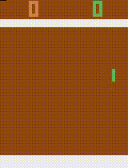

# DQN PyTorch

## Intro

This repo is fork from [jmichaux/dqn-pytorch](https://github.com/jmichaux/dqn-pytorch).

**8000 episode result:**



## Requirements

- gym (with atari)
- pytorch

**If you use conda:**

```bash
conda create --name <env> --file requirements.txt
```

## Run

**Training:**

```bash
python main.py -m train -bs 32 -epi 8000 -lr 1e-4 -env PongDeterministic-v4
```

**Test:**

```bash
python main.py -m test -bs 32 -epi 8000 -lr 1e-4 -env PongDeterministic-v4
```

## References

1. [Difference between Breakout-v0, Breakout-v4 and BreakoutDeterministic-v4?](https://github.com/openai/gym/issues/1280)
2. [Is there a comprehensive discription about every Envs except WIKI?](https://github.com/openai/gym/issues/1699)
3. [How does LazyFrames from OpenAI's baselines save memory?](https://stackoverflow.com/questions/61151105/how-does-lazyframes-from-openais-baselines-save-memory)
4. [jmichaux/dqn-pytorch](https://github.com/jmichaux/dqn-pytorch)
